# Family Heritage Tree

## Introduction

The Family Heritage Tree project is a web application designed to create, manage, and visualize family trees. Built using HTML, CSS, JavaScript, and Django, this platform allows users to enter family data and explore their lineage through interactive visualizations.

## Table of Contents

- [Installation](#installation)
- [Usage](#usage)
- [Features](#features)
- [Dependencies](#dependencies)
- [Configuration](#configuration)
- [Demo video](#video-demo)
- [Screenshots](#screenshots)
- [Troubleshooting](#troubleshooting)
- [Contributors](#contributors)

## Installation

To get started with the Family Heritage Tree, follow these steps:

### Prerequisites

- Python 3.8 or higher
- pip (Python package installer)
- Django

### Setting up a Virtual Environment

It's recommended to use a virtual environment to manage the dependencies:

```bash
python -m venv venv
source venv/bin/activate  # On Windows use `venv\Scripts\activate`
```

### Installing Dependencies

Install the required dependencies using pip:

```bash
pip install -r requirements.txt
```

### Running the Application

Navigate to the project directory and run the server:

```bash
python manage.py runserver
```

## Usage

To use the Family Heritage Tree application:

1. Open your web browser.
2. Navigate to `http://127.0.0.1:8000/`.
3. Start by creating your user account and then begin adding family members to your tree.

## Features

- **Interactive Tree Visualization**: View your family tree in an interactive graphical format.
- **User Authentication**: Secure user authentication system.
- **Data Management**: Add, edit, and delete family member entries with ease.

## Dependencies

- Django: The project is built on the Django web framework.
- HTML/CSS/JS: Used for designing and client-side scripting.

## Configuration

No additional configuration is required after the initial setup.

## Video Demo

<a href="https://drive.google.com/file/d/1Zv0gy827GQ9lWz8-ECB4JEsOWV4OtFBT/view" target="_blank"> Link to video</a>

## Screenshots

- **Main Interface**
  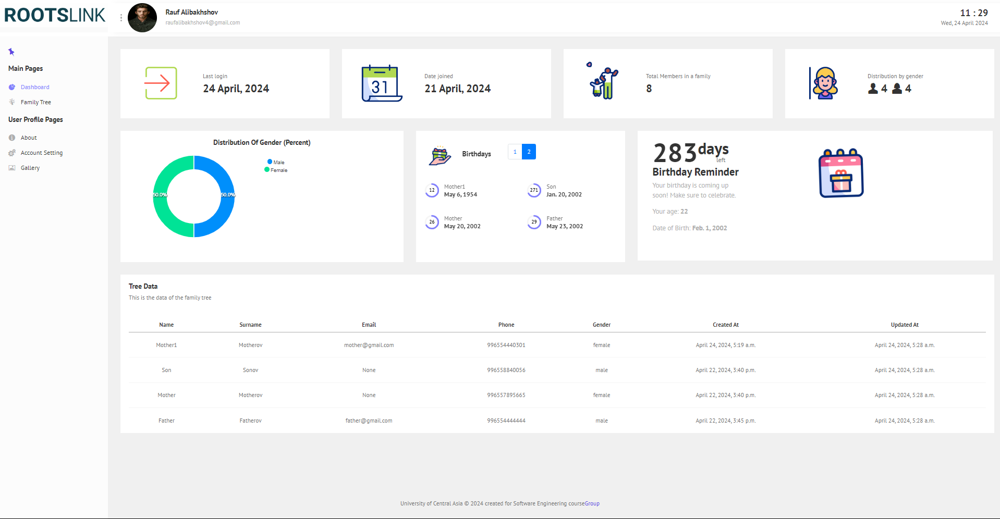
  
- **Family Tree Visualization**
  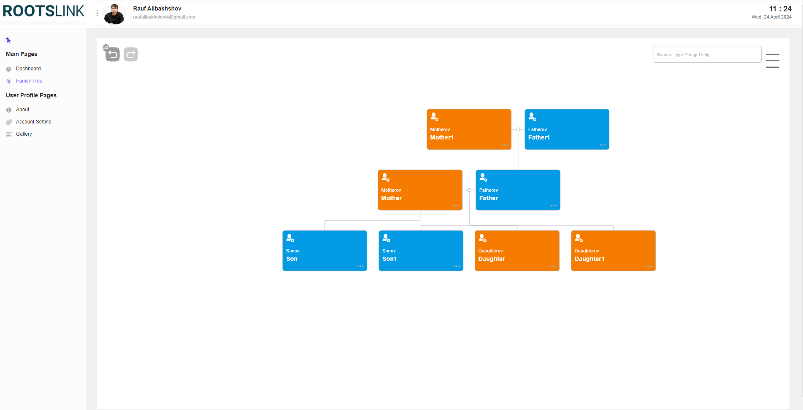
  
- **Family Tree Add**
  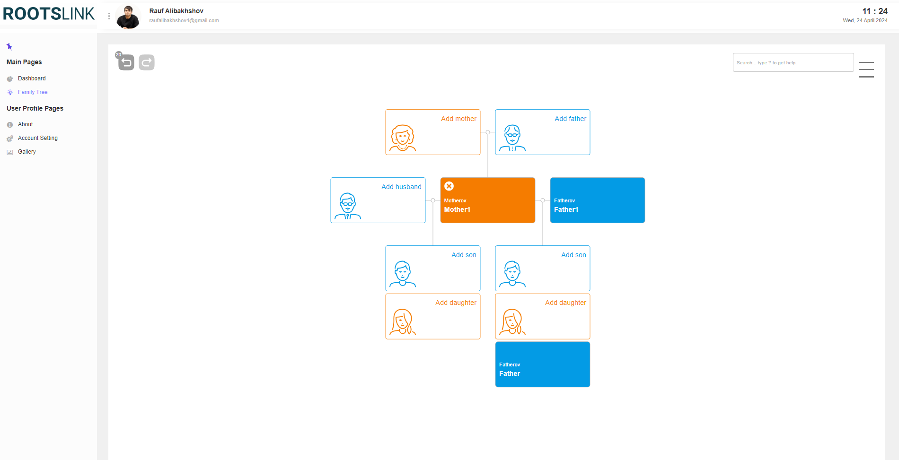
  
- **Family Tree Details**
  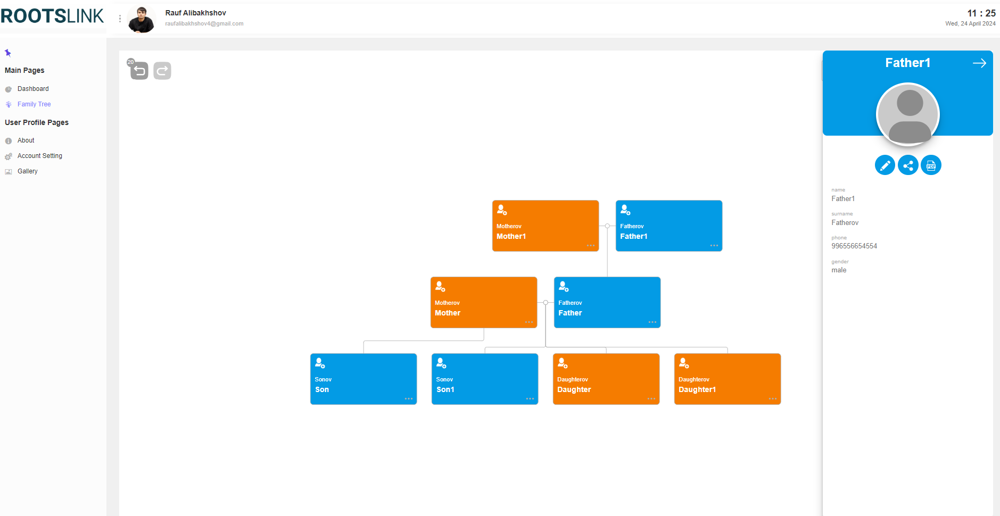
  
- **Gallery Page**
  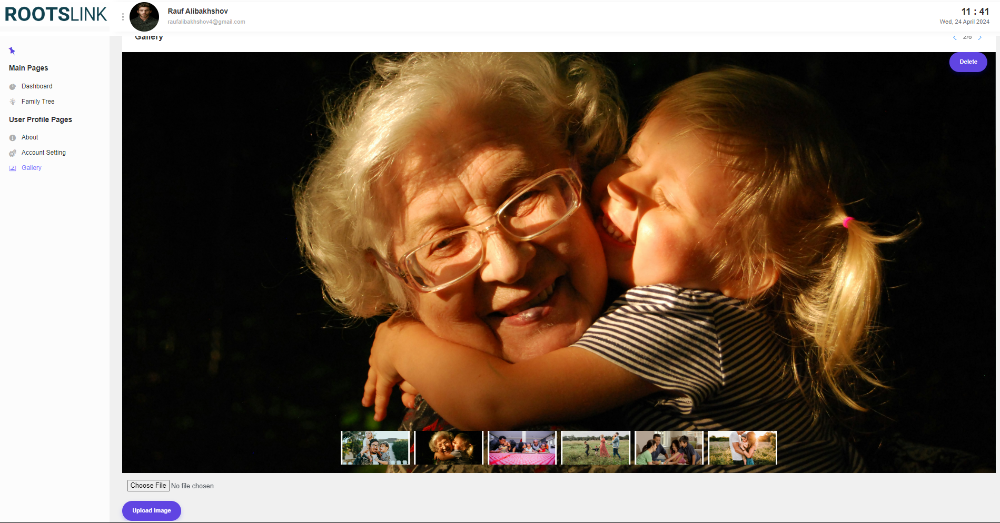
  
- **About Page - Contact**
  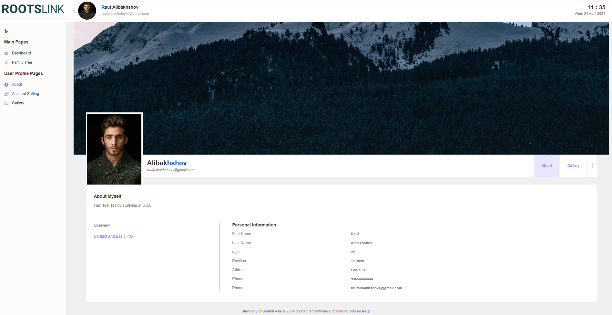
  
- **About Page - Overview**
  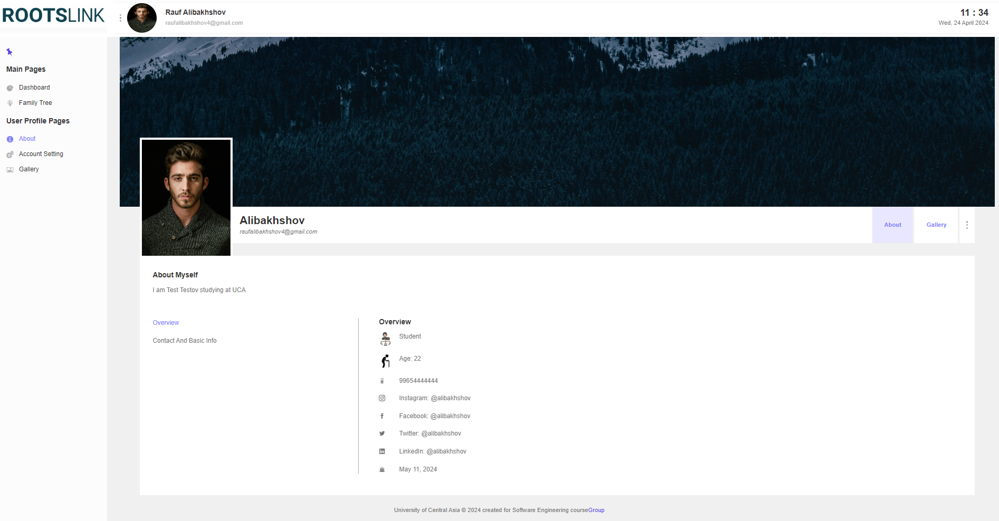
  
- **Settings Page - General**
  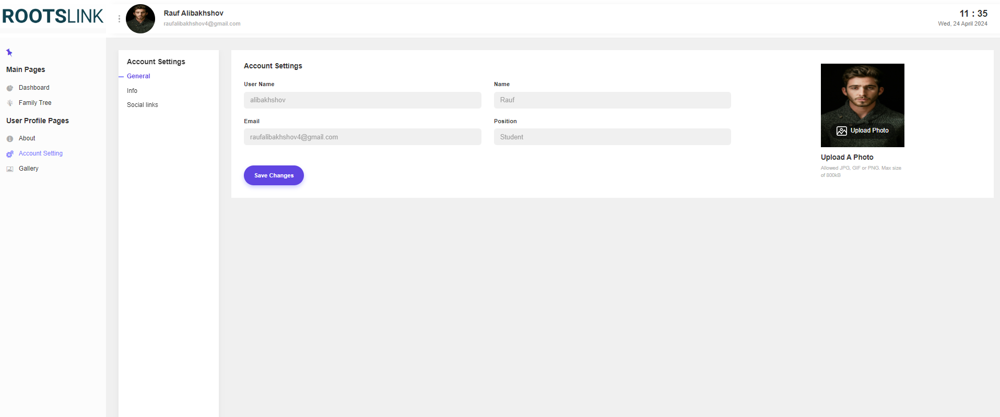
  
- **Settings Page - Info**
  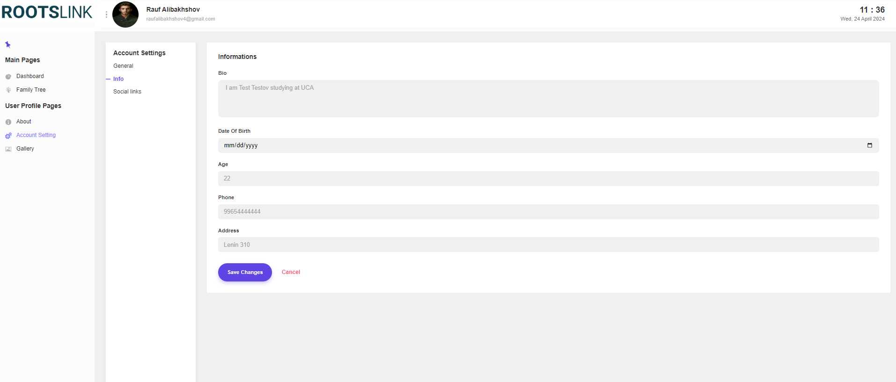
  
- **Settings Page - Social Media**
  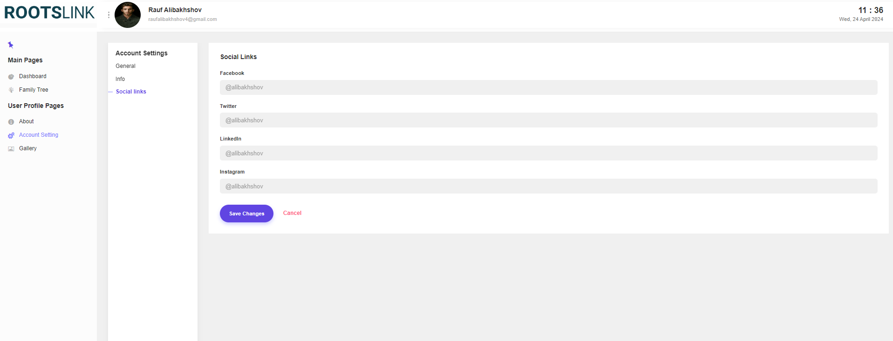

- **User Login Page**
  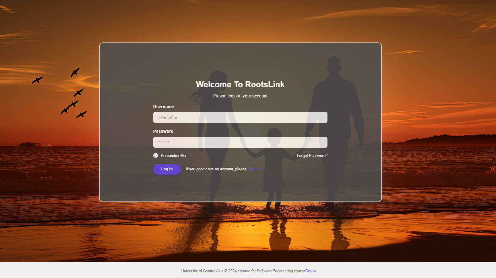
  
- **User Registration Page**
  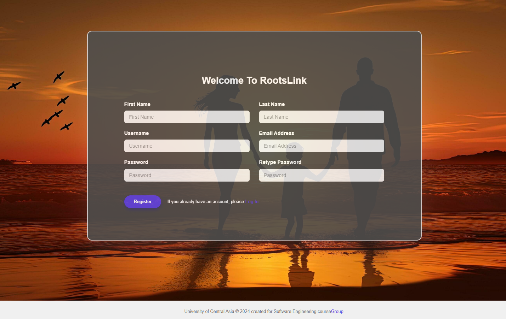
  
- **Reset Password Page**
  
  
- **User Message Page**
  


## Troubleshooting

For common issues:
- Ensure all dependencies are installed as per the `requirements.txt`.
- Check the Django server logs for any error messages.

